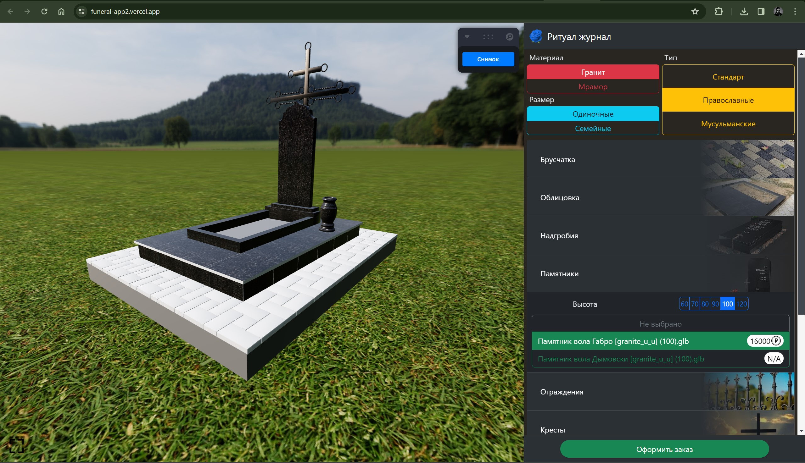
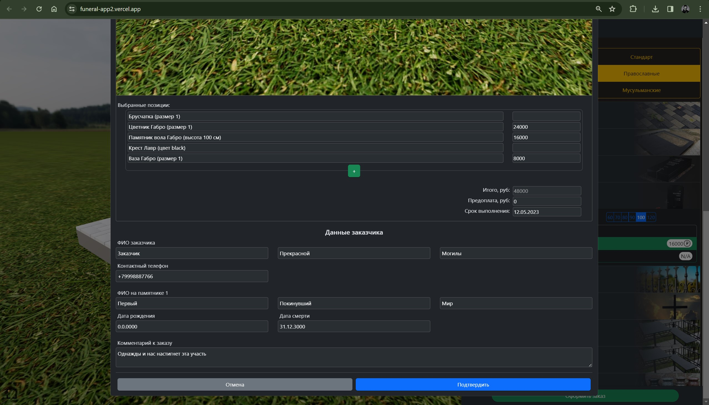

# Funeral App

<a name="readme-top"></a>

<!-- PROJECT LOGO -->
<br />
<div align="center">
  <a href="https://github.com/lostie21yo/funeral-app2">
    
  </a>
</div>

<!-- TABLE OF CONTENTS -->
<details>
  <summary>Table of Contents</summary>
  <ol>
    <li>
      <a href="#about-the-project">About The Project</a>
      <ul>
        <li><a href="#built-with">Built With</a></li>
      </ul>
    </li>
    <li>
      <a href="#getting-started">Getting Started</a>
      <ul>
        <li><a href="#installation">Installation</a></li>
      </ul>
    </li>
    <li><a href="#usage">Usage</a></li>
    <li><a href="#contact">Contact</a></li>
  </ol>
</details>


<!-- ABOUT THE PROJECT -->
## About The Project

This is a client web application for displaying 3D models of various objects (in this case, these are objects from the field of a funeral agency). For a more convenient choice, it is possible to filter by certain criteria. After selecting models and constructing a scene, it is possible to create a snapshot of a 3D area and then save it in a PDF document with all user-specified data.

<!-- Demo video on YouTube [here](https://www.youtube.com/watch?v=4na8KFVoyZM&list=PL4lVqWiqXeK15HICGgnRiJTThgfftHEyt&index=5) -->

<!-- <p align="right">(<a href="#readme-top">back to top</a>)</p> -->


### Built With

* HTML
* CSS
* JS
* React v18.2.0
* Three JS
* Node v18.10.0
* Bootstrap

<!-- <p align="right">(<a href="#readme-top">back to top</a>)</p> -->


<!-- GETTING STARTED -->
## Getting Started

<!-- ### Prerequisites -->

### Installation

1. Clone the repo
   ```sh
   git clone https://github.com/lostie21yo/funeral-app2
   ```
2. With Node installed run in console 
   ```sh
   npm install
   npm start
   ```

You can also open an already running application using [Vercel](https://funeral-app2.vercel.app/)
<!-- <p align="right">(<a href="#readme-top">back to top</a>)</p> -->


<!-- USAGE EXAMPLES -->
## Usage

1. On the left side of app you can see a 3D scene
2. On the right side you can select a certain models
3. You can make a snapshot by clicking "Снимок"
4. You can leave your information in a form by clicking "Оформить заказ"
5. You can save your order details by clicking "Подтвердить" and downloading a PDF file wherever you want

<div align="center">
    
</div>
<div align="center">
    
</div>

<!-- <p align="right">(<a href="#readme-top">back to top</a>)</p> -->


<!-- CONTACT -->
## Contact

Your Name - [Telegram](https://t.me/leoncox) - leon.coxsw@gmail.com

Project Link: [FuneralApp](https://github.com/lostie21yo/funeral-app2)

<p align="right">(<a href="#readme-top">back to top</a>)</p>


© 2023 GitHub, Inc.

